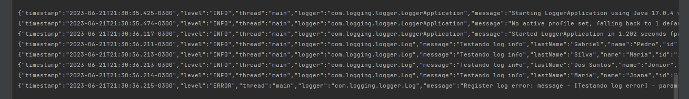

###### Custom Log

This project aims to solve the observability problem of the system, in many cases we can see
a problem in log applications, there is no flexibel, in many cases we have the following problem:

the message contains only one attribute, message for example

message: "The email for user 'Max' was successfully sent"

In this example we can see that the username is together with the rest of the text, which is not good for
look up the email in the apm tools... this fix may solve this problem given the programmer the flexibility to
put as many attributes he wants, here is an example

"{message: "The user's email was successfully sent, "user": "max", timestamp: '2022-03-01 13:32:00' }"

in json format

